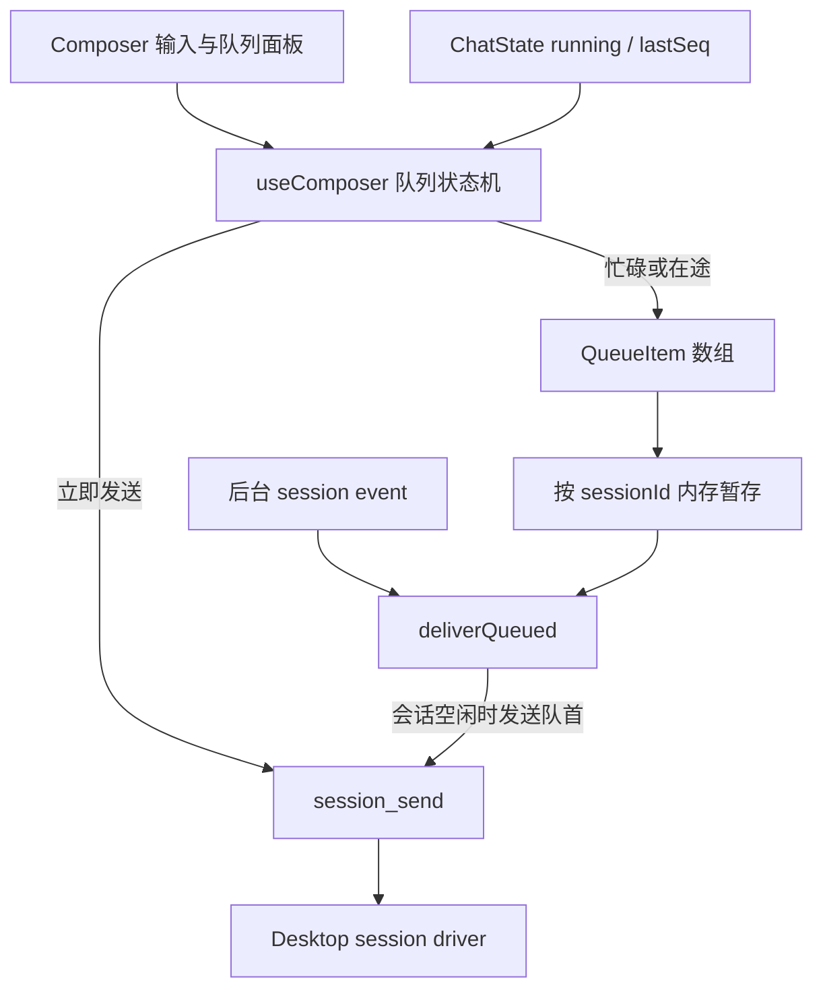
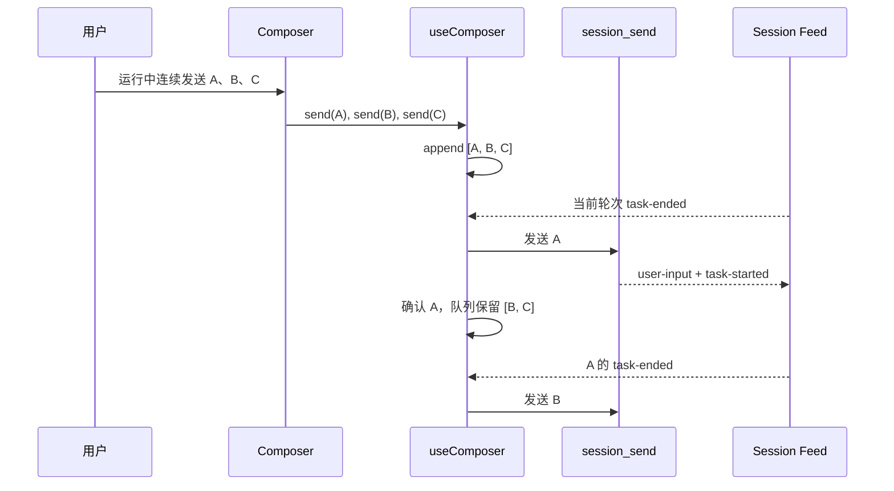

# 桌面端消息队列

Feature Name: desktop-message-queue
Updated: 2026-08-14

## Description

桌面端当前已支持单条排队，但数据结构为单槽 `queued: string | null`，用户在运行中连续发送时，后发消息会覆盖先发消息。该功能将单槽升级为当前会话的有序消息队列，并将现有排队提示升级为输入框上方的可折叠队列面板。

本期范围仅包含本地桌面会话。队列继续使用内存状态：切换会话或暂时离开聊天视图时保留，应用重启后清空。后端与帧协议不变，同一会话仍保持一次只执行一个轮次。

## Page Design

### Placement

队列面板放在聊天页固定 footer 内、`ComposerCard` 上方，与现有错误提示和任务计划保持同一内容宽度。队列项不进入消息日志，因为待执行项尚未发送，不能与已落盘的用户消息混合。

```text
┌──────────────────────── 对话日志 ────────────────────────┐
│                                                          │
├──────────────────────────────────────────────────────────┤
│ 任务计划（存在时）                                       │
│ ┌ 队列 · 3 条待处理 ─ 下一条：修复按钮样式 ──────── 〉 ┐ │
│ └──────────────────────────────────────────────────────┘ │
│ ┌──────────────── 输入框 ──────────────────────────────┐ │
│ │ 输入下一条消息……                                     │ │
│ │ [附件] [模式]                              [发送]     │ │
│ └──────────────────────────────────────────────────────┘ │
└──────────────────────────────────────────────────────────┘
```

### Collapsed State

- 队列非空时显示，空队列时隐藏。
- 标题显示“队列 · N 条待处理”。
- 单行显示队首正文摘要；只有附件时显示附件名称摘要。
- 右侧箭头用于展开，整行均为可点击区域。
- 默认折叠，避免队列持续挤压消息日志。

### Expanded State

```text
┌ 队列 · 3 条待处理 ──────────────────────────────── ﹀ ┐
│ ⠿  1  修复第一个按钮的间距                 [编辑] [删除] │
│ ⠿  2  统一注释中的术语                     [编辑] [删除] │
│ ⠿  3  补充对应测试                         [编辑] [删除] │
└───────────────────────────────────────────────────────┘
```

- 列表最大高度建议为 `11rem`，超出后面板内部滚动，避免 footer 无限长高。
- 每行包含拖拽手柄、顺序号、正文摘要、编辑按钮和删除按钮。
- 拖拽结束后立即更新执行顺序；键盘用户可通过排序控件的“前移/后移”菜单调整一位。
- 点击编辑后，仅该行进入内联编辑态；正文使用多行输入框，附件继续显示为可移除 chip。
- 编辑态提供“保存”和“取消”。空正文且无附件时不允许保存。
- 正在提交的队首项若仍短暂显示，则增加 spinner 并锁定管理操作；其余项仍可调整。

### Send Behavior

- 空闲且没有上行在途消息时，发送按钮保持当前行为：消息立即发送。
- 当前轮次运行中、上行仍在途或队列已有内容时，发送按钮将新消息追加到队尾。
- 输入框不增加“入队模式”开关；用户持续按 Enter/发送即可连续追加。
- 当前轮次结束后自动发送队首项，剩余项保持原顺序。
- 用户停止当前轮次时不清空队列，待会话空闲后继续队首项。

## Architecture



后端 `session_send` 的忙碌守卫继续作为同会话串行执行的最终约束。前端只有在 `running=false`、历史已加载、会话状态已归位且没有上行在途消息时发送队首项。

## Components and Interfaces

### `QueueItem`

```ts
interface QueueItem {
  id: string;
  text: string;
  atts: ComposerAtt[];
}
```

队列项保留结构化附件，直到实际发送时再通过 `attLine` 合成消息正文。该设计避免编辑正文时暴露内部附件路径行。

### `ComposerCtl`

将单槽接口替换为队列接口：

```ts
interface ComposerCtl {
  queue: QueueItem[];
  updateQueueItem(id: string, text: string, atts: ComposerAtt[]): void;
  removeQueueItem(id: string): void;
  moveQueueItem(id: string, targetIndex: number): void;
  // 其余现有字段保持不变
}
```

`send()` 在忙碌、上行在途或队列非空时追加新 `QueueItem`，不再覆盖已有内容。

### `QueuePanel`

新增独立展示组件，接收队列数据和管理回调。折叠状态由组件本地管理；队列数据仍由 `useComposer` 统一管理。组件不直接调用 IPC。

### `StashEntry`

```ts
interface StashEntry {
  draft: string;
  queue: QueueItem[];
  atts: ComposerAtt[];
}
```

`deliverQueued` 每次仅乐观取出队首项。提交失败时将原队列项恢复到队首；提交期间追加、编辑或排序的其他项保持不变。

## Data Flow



## Correctness Properties

1. **FIFO 默认顺序**：未发生用户排序时，队列项按照入队时间发送。
2. **可见顺序一致**：队列面板顺序、内存队列顺序和后续发送顺序一致。
3. **单轮互斥**：同一会话最多存在一个已提交但尚未结束的用户轮次。
4. **失败不丢失**：`session_send` 返回错误时，待发送队首项恢复到队首。
5. **会话隔离**：每个队列项只允许发送到创建该队列项的 `sessionId`。
6. **稳定身份**：排序和编辑使用稳定 `id`，不使用数组下标标识队列项。
7. **附件完整**：排序、切换会话和发送失败不改变队列项的附件集合。

## Error Handling

- **IPC 提交失败**：恢复队首项，沿用现有退避重试节奏，并显示 `ErrorBar`。
- **编辑为空**：保持编辑态并显示“消息内容不能为空”，不修改原队列项。
- **后台补投失败**：将队列项恢复至对应会话队首；若会话已切为活动状态，则交回活动 composer。
- **排序期间队列变化**：以稳定 `id` 定位项目；目标项目已开始提交时取消该次排序。
- **Agent 处理结果失败**：该轮次仍以 `task-ended` 结束，队列继续处理下一项；IPC 发送失败与 Agent 执行失败采用不同语义。

## Test Strategy

### State Tests

- 运行中连续发送三条消息后，队列按顺序包含三项。
- 轮次结束后仅发送队首项；下一轮结束后发送下一项。
- IPC 失败后队首项恢复且其余顺序不变。
- 会话切换、后台补投和迟到回执不会将消息发送到其他会话。
- 编辑、删除、前移和后移操作保持稳定 ID 和附件。
- 停止当前轮次后保留并继续队列。

### Component Tests

- 空队列不渲染面板。
- 折叠态显示数量和队首摘要。
- 展开态显示全部项目及正确顺序。
- 拖拽或键盘排序后，列表顺序和回调参数正确。
- 内联编辑可保存或取消；空消息不可保存。
- 删除只移除目标项目。
- 正在提交项的管理按钮不可用。

### Regression Tests

- 空闲发送仍立即调用 `session_send`。
- Enter、Shift+Enter 和输入法组合键行为保持不变。
- 草稿和附件发送失败后仍可恢复。
- 现有退避重试、历史加载闸门和帧水位闸门保持有效。

## Implementation Touchpoints

- 队列面板挂载位置：`desktop/ui-next/src/features/chat/composer/Composer.tsx:245-271`
- 输入和发送操作：`desktop/ui-next/src/features/chat/composer/Composer.tsx:304-313`、`desktop/ui-next/src/features/chat/composer/Composer.tsx:380-389`
- 单槽状态与发送分支：`desktop/ui-next/src/features/chat/composer/useComposer.ts:49-65`、`desktop/ui-next/src/features/chat/composer/useComposer.ts:92-119`、`desktop/ui-next/src/features/chat/composer/useComposer.ts:210-232`
- 自动补投状态机：`desktop/ui-next/src/features/chat/composer/useComposer.ts:260-282`
- 跨会话暂存和后台补投：`desktop/ui-next/src/features/chat/composer/stash.ts:14-20`、`desktop/ui-next/src/features/chat/composer/stash.ts:55-75`
- Footer 布局：`desktop/ui-next/src/features/chat/ChatView.tsx:970-978`
- 现有队列回归测试：`desktop/ui-next/src/features/chat/composer/useComposer.test.tsx:49-84`、`desktop/ui-next/src/features/chat/composer/useComposer.test.tsx:118-132`

## References

[^1]: `desktop/ui-next/src/features/chat/composer/Composer.tsx:251-266` - 当前单条排队提示。
[^2]: `desktop/ui-next/src/features/chat/composer/useComposer.ts:210-221` - 当前单槽后发覆盖逻辑。
[^3]: `desktop/ui-next/src/features/chat/TaskPanel.tsx:33-95` - 可复用的折叠面板视觉模式。
[^4]: `desktop/src/driver/session.rs:1322-1333` - 同一会话的后端忙碌守卫。
